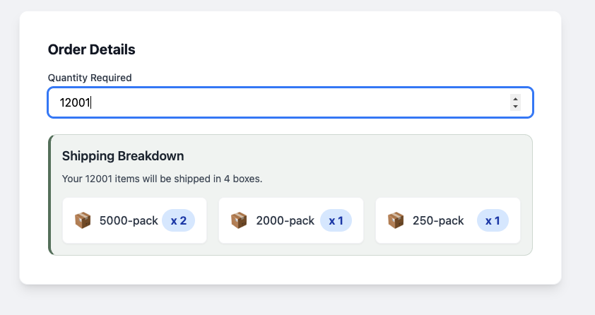

# Item Packing Calculator



## About
The Item Packing Calculator is a full stack web service. It figures out the best combination of packs needed to fulfill an order. It follows three strict rules:
* Only send whole packs (no breaking packs open).
* Ship as close to the ordered quantity as possible without going under.
* Use the smallest number of packs possible.

This project is mainly a backend Go service and an API design exercise. It includes a simple React frontend to show how the user interface works. The main focus is on clean Go architecture, algorithm design, system tracking, and contract first API development.

The API rules are written using the OpenAPI 3.0 specification. You can view them live at `GET /docs` (an interactive Swagger UI) and `GET /openapi.yaml` (the raw file). This file helps generate code for the frontend types and backend mocks.

The service uses zerolog for clear JSON logging. It also uses OpenTelemetry to track requests, sending data to Jaeger so you can view it.

Pack sizes are stored in memory when the app starts. The default sizes are 250, 500, 1000, 2000, and 5000. You can change these sizes while the app is running using the API.

## Assumptions
* Pack sizes are stored in memory. There is no permanent database. Changes made while the app is running will be lost when the app restarts.
* The service runs as a single instance. It does not need complex state management across multiple servers.
* The frontend is a basic user interface and not the main focus of this project. It is just an extra feature to show how the API works.

## Architecture
The backend uses a ports and adapters architecture. This keeps the core business rules completely separate from infrastructure details like HTTP networks or storage.

* `cmd/server/` : Entry point, sets up the app and starts the web server.
* `internal/core/domain/` : Core data models.
* `internal/core/ports/` : Interfaces and generated mocks.
* `internal/core/service/` : The core packing algorithm.
* `internal/adapters/api/` : HTTP handlers.
* `internal/adapters/storage/` : In memory storage.
* `frontend/` : React, TypeScript, and Vite UI.
* `openapi.yaml` : The official API rules.
* `swagger.html` : The Swagger UI page.
* `Dockerfile` : Docker build instructions for the backend.
* `docker-compose.yml` : Runs the backend, frontend, Jaeger, and Prometheus together.
* `Makefile` : Helpful developer commands.

## API Endpoints
* `POST /api/v1/packing/calculate` : Calculates the optimal pack combination for an order.
* `POST /api/v1/packs` : Adds a new pack size to the system at runtime.
* `DELETE /api/v1/packs` : Removes an existing pack size from the system at runtime.
* `GET /docs` : Interactive Swagger UI documentation.
* `GET /openapi.yaml` : Raw OpenAPI 3.0 specification file.

***Examples***

`POST` request to calculate the optimal packing for an order of 501 items:

```shell
curl -X POST http://localhost:8080/api/v1/packing/calculate \
  -H "Content-Type: application/json" \
  -d '{"orderQuantity": 501}'
```

```json
{
  "orderQuantity": 501,
  "totalItems": 750,
  "totalPacks": 2,
  "packs": [
    { "packSize": 500, "quantity": 1 },
    { "packSize": 250, "quantity": 1 }
  ]
}
```

`POST` to add a new pack size to the system at runtime:

```shell
curl -X POST http://localhost:8080/api/v1/packs \
  -H "Content-Type: application/json" \
  -d '{"size": 750}'
```

```json
{ "message": "action completed successfully" }
```

`DELETE` to remove a pack size from the system at runtime:

```shell
curl -X DELETE http://localhost:8080/api/v1/packs \
  -H "Content-Type: application/json" \
  -d '{"size": 750}'
```

```json
{ "message": "action completed successfully" }
```

## Algorithm
The packing service uses a smart recursive search to find the best pack combination for any order.

For very large orders, it first uses the largest available pack sizes to remove the bulk of the items. This prevents the server from running out of memory. Then, it runs the search on the remaining items. Finally, the two results are combined into one response.

## Examples

| Order Quantity | Packs Sent | Total Items |
| :--- | :--- | :--- |
| 1 | 1 x 250 | 250 |
| 250 | 1 x 250 | 250 |
| 251 | 1 x 500 | 500 |
| 501 | 1 x 500, 1 x 250 | 750 |
| 12001 | 2 x 5000, 1 x 2000, 1 x 250 | 12250 |

## Local Machine Run using Docker
To run the service, you can start all containers using Docker Compose.

Run this command in your terminal:
`make up`

This starts four containers:
* **Backend**: http://localhost:8080 (REST API)
* **Frontend**: http://localhost:3000 (React UI)
* **Jaeger UI**: http://localhost:16686 (Distributed trace viewer)
* **Prometheus**: http://localhost:9090 (Metrics)

## Makefile Commands
You can use these shortcuts in your terminal to manage the app and run tests:

* `make up` : Start all containers in the background
* `make down` : Stop all containers
* `make build` : Rebuild images and start them
* `make logs` : Stream live logs from all containers
* `make restart` : Restart all services
* `make clean` : Tear everything down, removing volumes and images
* `make test` : Runs only standard unit tests (ignores integration files)
* `make test-integration` : Runs only the integration tests inside the integration folder
* `make test-fuzz` : Runs the fuzz tests inside the core service for 10 seconds
* `make test-all` : Runs both unit tests and integration tests together

## Code Generation
We use the OpenAPI file to automatically create code, keeping the frontend and backend perfectly matched.

**Frontend**: We use openapi typescript to create TypeScript types.
`npx openapi-typescript http://localhost:8080/openapi.yaml -o ./frontend/src/types/api.ts`

**Backend**: We use mockgen to create mock interfaces for testing.
`mockgen -source=internal/core/ports/ports.go -destination=internal/core/ports/mocks/mock_service.go -package=mocks`

## Running Tests
This project includes three types of tests to ensure it is completely stable under pressure. You can run them easily using the included Makefile.

### 1. Standard Unit and Integration Tests
These test the standard happy paths and error branches.
* To run just the unit tests: `make test`
* To run just the integration tests: `make test-integration`
* To run all standard tests together: `make test-all`

### 2. Fuzz Tests
Fuzz testing bombards the core packing algorithm with millions of random inputs to find math errors or application crashes. It proves the math is always correct no matter what the user orders.
* To run the fuzz tests: `make test-fuzz`

### 3. k6 Load Tests
Load testing simulates thousands of warehouse workers trying to use the application at the exact same time to ensure the server does not slow down or crash.
To run the load test, you need two terminal windows:
* Terminal 1 (Start the server): `go run ./cmd/server`
* Terminal 2 (Run the load test): `cd frontend && npm run test:load`

## Observability
The backend is tracked with OpenTelemetry. It exports data so you can see exactly how long calculations take and what database calls were made. You can view these traces in the Jaeger UI at http://localhost:16686.

## Tech Stack
* **Backend**: Go 1.26, standard net/http library
* **Frontend**: React 18, TypeScript, Vite, Tailwind CSS
* **API Spec**: OpenAPI 3.0
* **Tracing**: OpenTelemetry to Jaeger
* **Metrics**: Prometheus
* **Testing**: testify, mockgen, k6, Go Fuzzing
* **Containers**: Docker, Docker Compose

## Upcoming Changes and Features

* **Persistent storage**: Replace the in memory store with a permanent database like DynamoDB so pack size changes survive restarts.
* **Frontend type generation**: Automate the type generation in the build pipeline so it is always up to date.
* **Health checks**: Add an endpoint to confirm the service is ready for traffic.
* **AWS Serverless deployment**: Move the Go HTTP handler into AWS Lambda for lower cost and automatic scaling. Deploy the React frontend as a static site on S3 and CloudFront.
* **GCP Serverless deployment**: Deploy the backend container directly to Google Cloud Run to scale to zero between requests. Serve the frontend via Firebase Hosting.
* **Kubernetes deployment**: Package the apps into a container registry and use standard deployments for teams that need more control over networking and scaling.