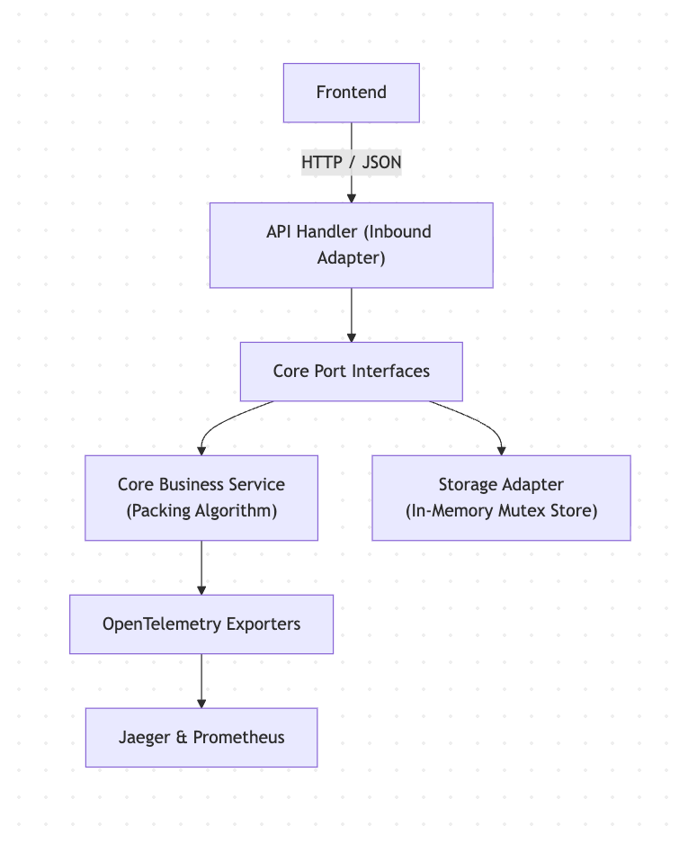

# System Design Document: Item Packing Calculator

## System Overview
The Item Packing Calculator is a stateless microservice built in Go using a Ports and Adapters (Hexagonal) architecture. It computes the mathematical minimum set of package sizes required to fulfill an order quantity while guaranteeing zero partial packs, zero under-shipping, and the absolute lowest pack count possible.

## Architecture Diagram

[//]: # ()
[//]: # (```mermaid)

[//]: # (flowchart TD)

[//]: # (    A["Frontend"] -->|HTTP / JSON| B["API Handler &#40;Inbound Adapter&#41;"])

[//]: # (    B --> C["Core Port Interfaces"])

[//]: # (    C --> D["Core Business Service<br/>&#40;Packing Algorithm&#41;"])

[//]: # (    C --> E["Storage Adapter<br/>&#40;In-Memory Mutex Store&#41;"])

[//]: # (    D --> F["OpenTelemetry Exporters"])

[//]: # (    F --> G["Jaeger & Prometheus"])

[//]: # ( ```)




## Component Architecture

| Layer / Component | Technology | Primary Responsibility |
| :--- | :--- | :--- |
| **Frontend UI** | React 18, TypeScript, Tailwind | Renders real-time packing calculations, status metrics, and quick-add presets. |
| **API Layer** | Go `net/http` | Handles input sanitization, JSON payload parsing, CORS, and rate limiting. |
| **Core Service** | Pure Go (Domain) | Executes packing optimization isolated from HTTP frameworks or storage engines. |
| **Storage Layer** | Thread-Safe Go Memory Store | Holds dynamic pack configurations (default: 250, 500, 1000, 2000, 5000) using RWMutex locks. |
| **Observability** | OpenTelemetry, Jaeger, Prometheus | Captures distributed execution spans, latency metrics, and structured JSON logs (`zerolog`). |

## Packing Algorithm Design

The domain algorithm combines recursive search with greedy bulk-reduction to balance accuracy and execution speed:

* **Bulk Reduction (Large Quantities):** Eagerly subtracts the largest available pack size from orders exceeding operational thresholds. This reduces target values to bounded sizes and eliminates stack overflow / memory exhaustion risks.
* **Recursive Branch-and-Bound Search:** Evaluates remaining target values against all active pack permutations to find the optimal solution satisfying:
    1. $\text{Total Items Shipped} \ge \text{Order Quantity}$
    2. $\text{Minimize } (\text{Total Items Shipped} - \text{Order Quantity})$
    3. $\text{Minimize } (\text{Total Pack Count})$

## API & Interface Specifications

The service follows a contract-first design driven by `openapi.yaml`.

* `POST /api/v1/packing/calculate`: Calculates optimal pack distribution for a given order quantity.
* `POST /api/v1/packs`: Adds a new pack size dynamically.
* `DELETE /api/v1/packs`: Removes a pack size dynamically.

## Resilience & Quality Assurance

* **Fuzz Testing:** Native Go fuzzing (`go test -fuzz`) tests the core domain algorithm against millions of pseudo-random inputs to prevent panic conditions and mathematical edge-case failures.
* **Trace Propagation:** OpenTelemetry context is injected at the API entry point and propagated through internal service calls to provide end-to-end trace visibility inside Jaeger.

## Future Scale Roadmap

* **Persistent Storage:** Replace the in-memory adapter with an AWS DynamoDB or PostgreSQL adapter by implementing the existing `StoragePort` interface.
* **Serverless Execution:** Compile the Go HTTP handler directly into an AWS Lambda or GCP Cloud Run deployment to reduce operational overhead and support scale-to-zero compute.

